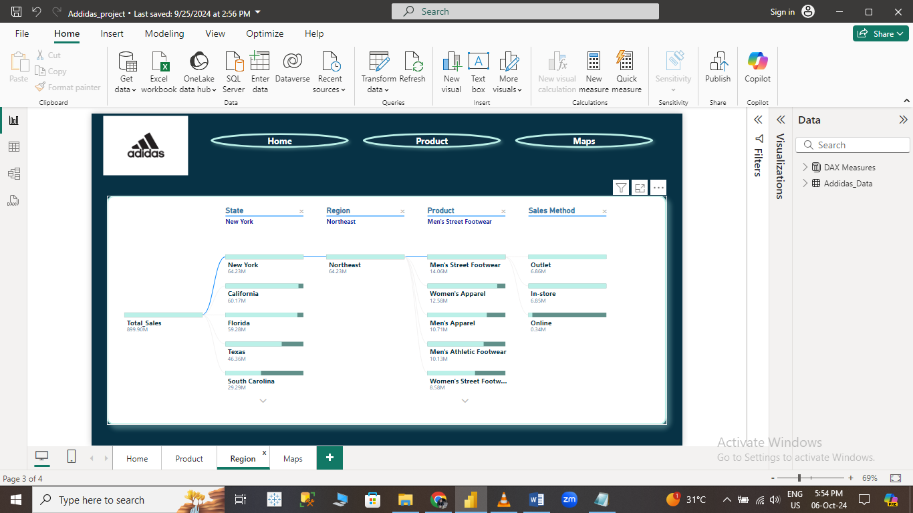

# Addidas_Project
# 👟 Adidas Shop Sales Report Dashboard using Power BI

  
*(A demo of the interactive Adidas Shop Sales Dashboard)*

---

## 📊 Overview

This project showcases an interactive **Power BI Dashboard** developed to analyze the sales performance of an **Adidas Shop**. The dashboard provides insights into sales trends, product performance, regional analysis, and customer behavior through various **DAX measures** and interactive visuals like **Maps** and **Decomposition Trees**.

The dataset includes several important tables and is broken into the following key areas:
- **Product Analysis**: Types of Adidas products and their sales performance.
- **Region Analysis**: Sales trends based on geographic regions.
- **Maps**: A geographical breakdown of sales performance by region.
- **Home**: A summary view of the overall sales performance.

---

## 🚀 Key Features

- **Interactive Power BI Pages**: Home, Product, Region, and Map analysis.
- **Decomposition Tree**: Breakdown of sales performance by different dimensions.
- **Dynamic Filters**: Filters to view data by region, product type, and date.
- **DAX Measures**: Custom calculations to provide key metrics using **SUM**, **DISTINCTCOUNT**, **MAX**, **MIN**, and **RANKX** functions.
- **Map Visualizations**: Geographical representation of sales performance.

---

## 🔍 Dashboard Views

### 1. **Home Page** 🏠
This page offers an overall view of the key metrics of Adidas Shop sales, such as:
- **Total Sales**
- **Unique Customers**
- **Top-Selling Products**

The Home page provides a summary using **cards** and **charts** to give an instant overview.

---

### 2. **Product Analysis Page** 🛍️
In this view, you can explore product-wise sales performance:
- **Product Categories** and **Units Sold**
- **Revenue** from each product
- **Top Products** ranked by sales using the **RANKX** function.

---

### 3. **Region Analysis Page** 🌍
The region page helps to understand sales trends based on geographic location:
- **Sales by Region**
- **Top Performing Regions**
- **Regional Sales Trends**

---

### 4. **Map Visualization Page** 🗺️
This page showcases **Map Visuals** for a geographical breakdown of Adidas sales:
- **Sales by Region**
- **Customer Distribution**
- **Top Sales Locations**

---

## 📐 DAX Measures Used
### 1. **Total Sales (SUM)**
Total Sales = SUM(Sales[SalesAmount])
Calculates the total revenue from Adidas sales.

2. Distinct Customer Count
DAX
Copy code
Unique Customers = DISTINCTCOUNT(Sales[CustomerID])
Calculates the number of unique customers who made purchases.

3. Maximum Sales Amount
DAX
Copy code
Max Sale = MAX(Sales[SalesAmount])
Returns the maximum sale made in a single transaction.

4. Minimum Sales Amount
DAX
Copy code
Min Sale = MIN(Sales[SalesAmount])
Returns the minimum sale made in a single transaction.

5. Top Products (RANKX)
DAX
Copy code
Top Products = RANKX(
    ALL(Products),
    [Total Sales],
    ,
    DESC,
    DENSE
)
Ranks products by sales volume, providing insights into the top-selling items.

📂 Pages and Navigation
The Power BI Dashboard is organized with page navigation to allow users to explore different aspects of sales data:

Home 🏠 – Overview of key metrics.
Product 🛍️ – Breakdown of sales by product categories.
Region 🌍 – Sales trends by region.
Maps 🗺️ – Geographic sales distribution.

With seamless navigation between pages, users can filter data by time period, region, and product category to drill into specific insights.

🛠️ Tools & Technologies Used
Power BI: For building interactive data visualizations and dashboards.
**DAX

